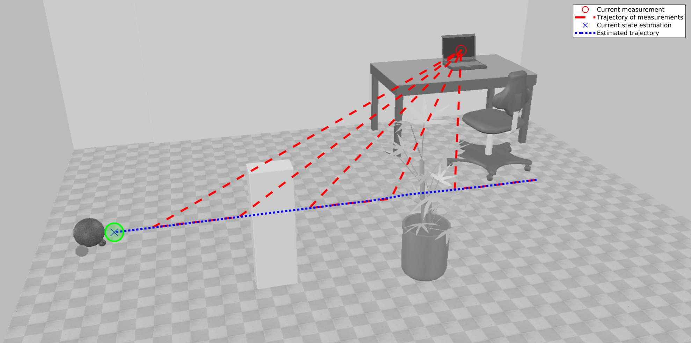

# Computer Vision Course Documentation

## Introduction

This document consolidates key insights and learnings from a series of advanced exercises in a Computer Vision course. It spans a variety of techniques from time-to-collision (TTC) estimation to Kalman Filters for object tracking, providing a detailed understanding of both theoretical concepts and practical applications.

## Table of Contents

1. [01 - Basics of Image Processing](#01---basics-of-image-processing)
2. [02 - Correlation and Edge Detection](#02---correlation-and-edge-detection)
3. [03 - Active Contours](#03---active-contours)
4. [04 - Hough Transform](#04---hough-transform)
5. [05 - Active Contours & Hough Transform](#05---active-contours--hough-transform)
6. [06 - Basic Camera Calibration](#06---basic-camera-calibration)
7. [07 - Time to Collision](#07---time-to-collision)
8. [08 - Dense Optical Flow](#08---dense-optical-flow)
9. [09 - Image Sequence Analysis using Kalman Filter](#09---image-sequence-analysis-using-kalman-filter)
10. [10 - Obstacle Detection](#10---obstacle-detection)
11. [References](#references)

## [01 - Basics of Image Processing](CRV-MASTERY/01%20-%20Basics%20of%20Image%20Processing/task1.md)

### Key Learnings

- Image files are read, visualized, and saved, emphasizing the distinction between grayscale and color (RGB) images.
- Color images are deconstructed into their individual channels (Red, Green, and Blue), and different methods of converting these to grayscale are explored.
- Noise is added to images to simulate real-world scenarios, and various denoising methods are implemented to improve image quality.
- Advanced denoising challenges are tackled, with results evaluated using metrics such as PSNR.

### Implementation Highlights

- Understanding multi-dimensional array storage for image representation.
- Exploring effects of image processing techniques on image quality.

## [02 - Correlation and Edge Detection](CRV-MASTERY/02%20-%20Correlation%20and%20edge%20detection/task02.md)

### Key Learnings

- The fundamentals of implementing 2D correlation in image processing are discussed, including input validation and the intricacies of the calculation.
- Simple to complex edge detection operators (Prewitt, Sobel, Scharr) are employed and optimized for different images.
- The importance of preprocessing, such as denoising, is emphasized to enhance the edge detection results.

### Implementation Highlights

- Analyzing image sequences to predict collisions.
- Importance of accurately estimating 3D motion from 2D image displacements.

## [03 - Active Contours](CRV-MASTERY/03%20-%20Active%20contours/task03.md)

### Key Learnings

- The process of visualizing curves and handling user input to create initial curves is covered.
- The implementation of the shrinking method for active contour modeling is detailed, with attention to energy calculation and optimization methods.

### Implementation Highlights

- Active contour segmentation is applied to various images, assessing the effectiveness and optimization of the parameters.

## [04 - Hough Transform](CRV-MASTERY/04%20-%20Hough%20Transform/task04.md)

### Key Learnings

- Development of a custom Hough Transform function are described and strategies for applying the algorithm to detect straight lines and refine the detection with parameter adjustments.

### Implementation Highlights

- The robustness of the Hough Transform against image noise and gaps is noted, along with the complexity and optimization possibilities.

## [05 - Active Contours & Hough Transform](CRV-MASTERY/05%20-%20Active%20Contours%20&%20Hough%20Transform/task05.md)

### Key Learnings

- Combining active contour segmentation with Hough Transform for enhanced feature detection.

## [06 - Basic Camera Calibration](CRV-MASTERY/06%20-%20Basic%20Camera%20Calibration/task06.md)

### Key Learnings

- The process of camera calibration is described, from capturing calibration images to determining intrinsic parameters.
- A 'virtual ruler' is created to measure objects within images, using the calibration data to convert pixel measurements to real-world units.

### Implementation Highlights

- Circle detection is used to classify coins, demonstrating the application of image analysis for object classification.

## [07 - Time to Collision](CRV-MASTERY/07%20-%20Time%20to%20collision/task07.md)

### Key Learnings

- TTC estimation is crucial for autonomous navigation systems.
- Techniques for analyzing image sequences to predict collisions.

### Implementation Highlights

- Utilized edge detection and Hough transforms for analyzing object size changes over time in image sequences.

## [08 - Dense Optical Flow](CRV-MASTERY/08%20-%20Dense%20optical%20flow/task08.md)

### Key Learnings

- Understanding the computation of gradients and optical flow in image sequences.
- The significance of local analysis areas in detecting various motion patterns.

### Implementation Highlights

- Developed functions for calculating and visualizing optical flow.
- Applied optical flow algorithms to track movements in dynamic environments.

## [09 - Image Sequence Analysis using Kalman Filter](CRV-MASTERY/09%20-%20Image%20sequence%20analysis%20using%20Kalman/task09.md)

### Key Learnings

- The operation and implementation of the Kalman Filter for dynamic systems.
- Adjusting Kalman Filter parameters for improved estimation accuracy.

### Implementation Highlights

- Implemented the Kalman Filter for tracking a robot's position in an image sequence.
- Experimented with different system models to optimize tracking performance.

## [10 - Obstacle Detection](CRV-MASTERY/10%20-%20Obstacle%20detection/task10.md)

### Key Learnings

- Techniques for extracting and matching salient points across consecutive images.
- Detection of obstacles by analyzing the spatial relationships of matched points.

### Implementation Highlights

- Used singular value decomposition for obstacle detection in image tiles.
- Visualized detection outcomes with color-coded points based on detection results.

## References

- [OpenCV Documentation](https://docs.opencv.org/master/index.html)
- [SciKit-Image Documentation](https://scikit-image.org/docs/stable/index.html)
- [MATLAB Image Processing Toolbox](https://www.mathworks.com/products/image.html)

## Conclusion

This document captures a wealth of knowledge acquired through the completion of advanced computer vision exercises. From theoretical understanding to hands-on applications, these exercises have imparted a deep comprehension of various computer vision techniques and their real-world implications.
## Disclaimer

The exercises 6 & 7 don't work as expected. Further adjustments will be added.